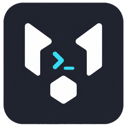

<div align="center">



# ModelCrew

[](https://github.com/xpl0itK3y/modelcrew-desktop/releases)
[](https://tauri.app)
[](https://www.rust-lang.org)
[](https://www.typescriptlang.org)
[](https://react.dev)
[](https://vitejs.dev)
[](https://github.com/xpl0itK3y/modelcrew-desktop/releases)
[](LICENSE)

### A fast terminal workspace for running AI coding agents side by side

Six agents, six panels — with live git diffs, per-panel history,
and a nudge the moment one of them needs you.

[**Features**](#features) · [**Supported agents**](#supported-agents) · [**Install**](#install) · [**Shortcuts**](#keyboard-shortcuts) · [**Development**](#development)

</div>

---

ModelCrew is a modular, agent-based development system where each agent role
can run on a separate model, and you stay in control of quality, cost,
security, and the level of autonomy.

The current release is the **terminal foundation** — a desktop terminal
manager built on **Tauri 2**, **React 18**, **TypeScript**, **Vite**,
**xterm.js**, **dockview**, and a Rust **portable-pty** backend. Terminals
arrange themselves into a fleet grid, live inside project workspaces, are
driven by mouse and hotkeys, and title themselves after the running program.

## Features

| Feature | What it does |
|---|---|
| **Fleet grid layout** | New terminals split the grid automatically. Drag the wide grab zones to resize, zoom any panel to full window, or arrange everything into a tidy grid with one titlebar click. |
| **Session restore** | Every session of a project comes back alive at launch — terminals reopen with their previous text and each panel resumes **its own** agent conversation, bound precisely per panel. |
| **Live git panel** | A slide-over showing uncommitted changes in real time as agents edit files: per-file diffs with live counters, a commit box, one-click revert, a branch switcher, and full commit history. |
| **Agent alerts** | When an out-of-sight agent finishes or waits for your decision, ModelCrew plays a sound, shows a system banner naming the agent and project, and badges the app icon with the count of waiting panels. |
| **Per-panel history** | Each terminal keeps its own shell history (zsh, bash, fish), so pressing arrow-up never leaks commands between panels. |
| **Resilient updates** | Signed auto-updates download in the background into a persistent cache — a restart never re-downloads — with progress and release notes in the notification center. |

**Also inside:** projects → sessions → terminals (one folder = one project,
enforced by the backend, friendly codenames like `amber-lynx`) · native PTY
backend with batched output and WebGL rendering · titles that follow the
foreground process · six themes, accent colors, shell picker, font size and
notification sounds · English / Russian interface · macOS, Windows and Linux
installers with auto-update.

## Supported agents

Each panel remembers **which** conversation it was running and resumes
exactly that one — six Claude Code panels get six different chats. Eleven
CLIs are recognized:

<div align="center">

`Claude Code` · `Codex` · `OpenCode` · `Kilo Code` · `Grok` · `Cursor` ·
`Gemini CLI` · `Qwen Code` · `Aider` · `Amp` · `Antigravity`

</div>

## Install

Download installers from the
[**Releases**](https://github.com/xpl0itK3y/modelcrew-desktop/releases) page:

| Platform | Packages |
|---|---|
| **macOS** | `.dmg` (Apple Silicon, Intel) |
| **Windows** | setup `.exe`, `.msi` |
| **Linux** | `.AppImage`, `.deb`, `.rpm`, `.pkg.tar.zst` |

On Arch Linux, prefer the native package:

```bash
sudo pacman -U ModelCrew_x.y.z_linux_x86_64.pkg.tar.zst
```

…or build `modelcrew-bin` from the attached `PKGBUILD`. Both x86_64 and
aarch64 packages are compiled on Arch itself, against the same libraries they
will run with. Every package
declares what ModelCrew runs at runtime — `git` for the change panel,
`pkexec` for installing updates, `xdg-open` for links, plus WebKitGTK,
GStreamer audio plugins and tray support. The AppImage carries GStreamer
itself so notification sounds work out of the box.

> **Linux notifications:** system banners use the standard
> `org.freedesktop.Notifications` D-Bus service. Desktop environments
> provide it out of the box; bare window managers (Hyprland, i3, sway) need
> a notification daemon such as `mako` or `dunst` running.

> **AppImage requirements:** the image carries its own WebKitGTK, GTK and
> GStreamer, but never its own `libc`, GPU drivers or `git` — those always
> come from your system. It therefore needs a distribution at least as new as
> the one it was built on (Ubuntu 22.04), and `libfuse2` to mount itself. On
> distributions that ship only FUSE 3, run it without mounting:
> ```bash
> ./ModelCrew_x.y.z_linux_x86_64.AppImage --appimage-extract-and-run
> ```

> **Black window on Linux:** WebKitGTK's DMABUF renderer leaves a blank
> window on some drivers, so ModelCrew disables it by default. Set
> `WEBKIT_DISABLE_DMABUF_RENDERER=0` to get the faster path back, or `=1` to
> keep it off explicitly. If a window still stays black, turn accelerated
> compositing off as well:
> ```bash
> WEBKIT_DISABLE_COMPOSITING_MODE=1 modelcrew-desktop
> ```

## Keyboard shortcuts

| macOS | Windows / Linux | Action |
|---|---|---|
| ⌘T | Ctrl&nbsp;+&nbsp;T | New terminal in the grid |
| ⌘W | Ctrl&nbsp;+&nbsp;W | Close the active terminal |
| ⌘⇧W | Ctrl&nbsp;+&nbsp;Shift&nbsp;+&nbsp;W | Close the group (with confirmation) |
| ⌘⌥&nbsp;+&nbsp;arrows | Ctrl&nbsp;+&nbsp;Alt&nbsp;+&nbsp;arrows | Focus the neighboring terminal |
| ⌘⇧&nbsp;+&nbsp;arrows | Ctrl&nbsp;+&nbsp;Shift&nbsp;+&nbsp;arrows | Swap with the neighbor; at an edge — new split |
| hold&nbsp;⌘⌥ | hold&nbsp;Ctrl&nbsp;+&nbsp;Alt | Show panel numbers overlay |
| ⌘⌥&nbsp;+&nbsp;digit | Ctrl&nbsp;+&nbsp;Alt&nbsp;+&nbsp;digit | Focus panel № |
| ⌘⌥⇧&nbsp;+&nbsp;digit | Ctrl&nbsp;+&nbsp;Alt&nbsp;+&nbsp;Shift&nbsp;+&nbsp;digit | Swap the active panel with № |
| ⌘↩ | Ctrl&nbsp;+&nbsp;Enter | Zoom the panel / restore the layout |
| ⌘⌥&nbsp;+/− | Ctrl&nbsp;+&nbsp;Alt&nbsp;+/− | Grow / shrink the panel by 5% |
| ⌘&nbsp;+&nbsp;drag | Ctrl&nbsp;+&nbsp;drag | Drag a terminal anywhere to swap panels |

**Mouse tips**

- Double-click a panel title to rename it (pins the name).
- Double-click a project or session in the sidebar to rename it.
- The gear in the title bar opens Settings (appearance, terminal, notifications).

## Development

```bash
npm install
npm run tauri dev     # dev mode
npm run tauri build   # release build (.app / installer)
```

```bash
npm test                       # frontend tests (vitest)
cd src-tauri && cargo test     # backend tests (PTY, git, batching, stress)
```

The Git backend is also covered end to end against a real server. Those runs
need network access and write permission, so they are opt-in:

```bash
MODELCREW_TEST_REMOTE=git@github.com:you/scratch-repo.git \
  cargo test -- --ignored live_workflow
```

It publishes a uniquely named `modelcrew-test/…` branch, drives push, pull,
divergence and rebase through it, and deletes the branch afterwards.

<details>
<summary><b>Releases and updates</b></summary>

<br>

The version is changed with a single command:

```bash
npm run version:set -- 0.0.5
```

It synchronizes npm and Cargo, creates a bilingual template in
`release-notes/` and a section in `CHANGELOG.md`, but does **not** create a
Git tag. Validate the metadata before tagging:

```bash
npm run release-scripts:test
npm run release-notes:validate
npm run changelog:validate
npm run release:validate
```

Every push to `main` builds nightly artifacts, and a `vX.Y.Z` tag runs the
stable workflow. Installers and `latest.json` are published on the
[Releases](https://github.com/xpl0itK3y/modelcrew-desktop/releases) page.
Key setup, package formats, and manual verification are described in
[`packaging/README.md`](packaging/README.md).

</details>

## Roadmap

The terminal foundation is shipping. Built on top of it, next:

- [ ] Agent orchestration (swarm)
- [ ] Kanban task board
- [ ] Memory with a relation graph
- [ ] Built-in browser preview

## License

[MIT](LICENSE) © Denis

<div align="center">
<sub>Built with Tauri, React, and a Rust PTY core.</sub>
</div>
