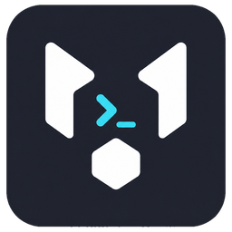
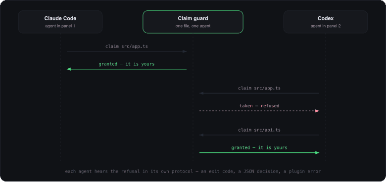
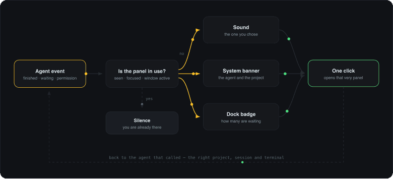
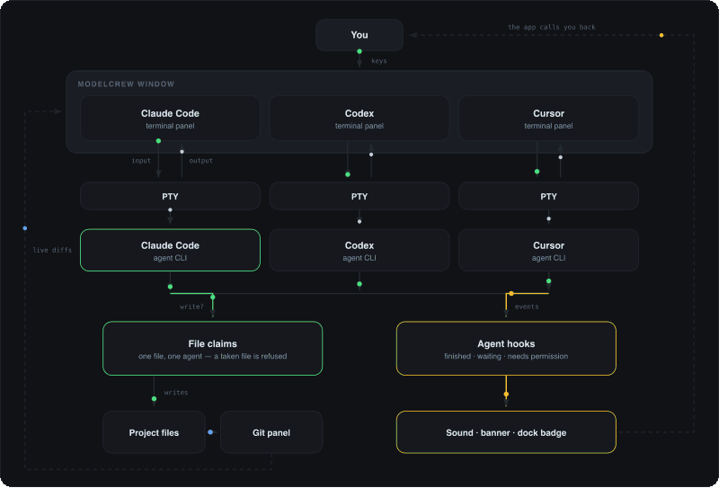

<div align="center">



# ModelCrew

### A fast terminal workspace for running AI coding agents side by side

Six agents, six panels — with live git diffs, per-panel history,
and a nudge the moment one of them needs you.

[](https://github.com/xpl0itK3y/modelcrew-desktop/releases)
[](https://github.com/xpl0itK3y/modelcrew-desktop/releases)
[](https://github.com/xpl0itK3y/modelcrew-desktop/actions/workflows/ci.yml)
[](https://github.com/xpl0itK3y/modelcrew-desktop/releases)
[](LICENSE)

[](https://github.com/xpl0itK3y/modelcrew-desktop/releases/latest)

<!-- ─────────────────────────────────────────────────────────────
     HERO — the product itself, before any diagram.
     Record ~12s: empty grid → panels split in → agents start in two
     of them → one edits a file → diffs run in the git panel → a
     banner arrives from a panel that is off screen.
     Then delete this comment and uncomment the line below.


     ───────────────────────────────────────────────────────────── -->

[**Why ModelCrew**](#why-modelcrew) · [**Features**](#features) · [**Agents**](#supported-agents) · [**Install**](#install) · [**Shortcuts**](#keyboard-shortcuts) · [**Development**](#development) · [**Website**](https://modelcrew-com.vercel.app/)

</div>

---

ModelCrew is a desktop terminal manager for working with several AI coding
agents at once. Terminals arrange themselves into a grid, live inside project
workspaces, come back after a restart with their text and their conversations,
and say when one of them is waiting for you.

Built on **Tauri 2** with a Rust **portable-pty** backend, **React 18**,
**TypeScript**, **Vite**, **xterm.js** and **dockview**.

## Why ModelCrew

A grid of terminals is easy to get from tmux or any split-pane terminal. What
is hard is everything that starts happening once real agents are running
inside them:

- **They collide.** Two agents in one folder overwrite each other's work.
  ModelCrew makes a file claim first, and refuses a write over a stale read.
- **They wait in silence.** An agent that finished, or that needs permission,
  sits in a panel you are not looking at. ModelCrew comes and finds you.
- **They lose the thread.** Reopening a terminal normally starts a fresh chat.
  Here each panel resumes **its own** conversation, exactly the one it had.
- **They share your history.** In split panes, arrow-up shows a neighbour's
  commands. Every panel here keeps a shell history of its own.

## Supported agents

Each panel remembers **which** conversation it was running and resumes exactly
that one — six Claude Code panels get six different chats. Four CLIs are
recognized:

<div align="center">

`Claude Code` · `Codex` · `GitHub Copilot` · `OpenCode`

</div>

## Features

| Feature | What it does |
|---|---|
| **Fleet grid layout** | New terminals split the grid automatically; any panel zooms to the full window. |
| **Session restore** | Terminals reopen with their previous text, and each panel resumes its own agent conversation. |
| **One project, several agents** | A file is claimed before it is edited; a file a neighbour holds is refused, and so is a stale write. |
| **Live git panel** | Uncommitted changes in real time: per-file diffs, a commit box, one-click revert, branches, history graph. |
| **Project tree and editor** | The project's files beside the terminals, with search by name and syntax highlighting. |
| **Agent alerts** | A sound, a system banner and a badge on the app icon when an out-of-sight agent needs you. |
| **Per-panel history** | Arrow-up never leaks commands between panels — zsh, bash and fish each kept apart. |
| **Resilient updates** | Signed auto-updates download in the background; a restart never re-downloads them. |

<!-- ─────────────────────────────────────────────────────────────
     SCREENSHOTS — one row of three, once they exist:
     docs/assets/screen-git.png     · the git panel with a live diff
     docs/assets/screen-editor.png  · tree and the open file
     docs/assets/screen-themes.png  · settings, nine themes

<div align="center">
  
  
  
</div>
     ───────────────────────────────────────────────────────────── -->

<details>
<summary><b>The same features, in full</b></summary>

<br>

- **Session restore.** Every session of a project comes back alive at launch —
  terminals reopen with their previous text and each panel resumes **its own**
  agent conversation, bound precisely per panel.
- **One project, several agents.** Before an agent edits a file it claims it;
  a file already taken is left to its neighbour, and a write over a stale read
  is refused. Each agent hears the refusal in its own protocol — an exit code,
  a JSON decision, a plugin error.
- **Live git panel.** Uncommitted changes in real time as agents edit files:
  per-file diffs with live counters, a commit box, one-click revert, a branch
  switcher and history with a graph. An unfinished merge, rebase, cherry-pick
  or revert is named by a banner with Continue and Abort, and a commit is
  refused while conflict markers are still in the files.
- **Project tree and editor.** The project's files beside the terminals: a
  tree that follows the disk, search by name, and a column of its own for the
  open file with syntax highlighting and line numbers.
- **Agent alerts.** When an out-of-sight agent finishes or waits for your
  decision, ModelCrew plays a sound, shows a system banner naming the agent
  and project, and badges the app icon with the count of waiting panels.
- **Resilient updates.** Signed auto-updates download in the background into a
  persistent cache — a restart never re-downloads — with progress and release
  notes in the notification center. A downloaded update keeps its badge until
  it is installed, so reading the notification never hides it.

**Also inside:** projects → sessions → terminals (one folder = one project,
enforced by the backend, friendly codenames like `amber-lynx`) · native PTY
backend with batched output and WebGL rendering · titles that follow the
foreground process · nine themes, eighteen accent colors, shell picker, font
size and notification sounds · English / Russian interface · macOS, Windows
and Linux installers with auto-update.

</details>

## One project, several agents

Two agents in one folder used to overwrite each other's work. Now a file is
claimed before it is edited, and a write over a stale read is refused.

<div align="center">

</div>

The handshake in full: Claude Code asks for `src/app.ts` and gets it. Codex
asks for the same file a moment later, is told it is taken, and goes to
`src/api.ts` instead — which it gets. Nothing was queued and nothing was
lost; the second agent simply did the next thing.

The refusal arrives in the shape each agent expects: exit code 2 with a
reason on stderr for Claude Code and Codex, a JSON decision for Copilot, a
thrown plugin error for OpenCode. The reason matters as much as the refusal —
told only "no", an agent reaches for the same file again, or writes it through
the shell behind the guard's back.

## When an agent needs you

<div align="center">

</div>

The agent says so itself, through its hook — nothing here is guessed from
what scrolled past in the terminal. ModelCrew then asks one question: are you
already in that panel? That means all three at once — the panel is on screen,
the caret is in it, and the window is focused. If it is, nothing happens;
you are looking straight at it. Otherwise the panel is marked as waiting, and
a sound, a system banner naming the agent and the project, and a badge on the
app icon go out. Any of them opens that exact panel — the right project, the
right session, the right terminal.

Repeat signals from one panel are held to one every fifteen seconds, unless
the new one asks for more than the last did: a permission request arriving a
second after "finished" is never the one that gets swallowed.

## How it works

<div align="center">

</div>

Reading the diagram from the top:

- **You → panel → PTY → agent.** What you type goes to that panel's own PTY,
  where your shell — zsh, bash or fish — is running the agent CLI. Output
  comes back up the same column, which is why arrow-up in one panel never
  shows a neighbour's commands.
- **Agent hooks.** An agent reports to ModelCrew through its own hook, not
  through guesses about its output. One channel carries two kinds of traffic:
  claims turn left, events turn right.
- **Claim guard.** Before an agent edits a file it asks. It is *blocked*
  until the answer travels back up the channel — the green `verdict` arrow.
  A file a neighbour holds is refused, and so is a write over a stale read.
- **Alerts.** `finished`, `waiting` and `needs permission` are worth
  interrupting you for only when you are not already in that panel. When you
  are not, they become a sound, a banner and a badge.
- **Back to you** — the dashed lines. Edits show up as live diffs in the git
  panel, and a waiting agent finds you wherever you are in the app.

## Install

Download installers from the
[**Releases**](https://github.com/xpl0itK3y/modelcrew-desktop/releases) page:

| Platform | Packages |
|---|---|
| **macOS** | `.dmg` (Apple Silicon, Intel) |
| **Windows** | setup `.exe`, `.msi` |
| **Linux** | `.AppImage`, `.deb`, `.rpm`, `.pkg.tar.zst` |

<details>
<summary><b>Arch Linux packages</b></summary>

<br>

On Arch Linux, prefer the native package:

```bash
sudo pacman -U ModelCrew_x.y.z_linux_x86_64.pkg.tar.zst
```

…or build `modelcrew-bin` from the attached `PKGBUILD`. Both x86_64 and
aarch64 packages are compiled on Arch itself, against the same libraries they
will run with. Every package declares what ModelCrew runs at runtime — `git`
for the change panel, `pkexec` for installing updates, `xdg-open` for links,
plus WebKitGTK, GStreamer audio plugins and tray support. The AppImage carries
GStreamer itself so notification sounds work out of the box.

</details>

<details>
<summary><b>Linux: notifications, AppImage requirements, a black window</b></summary>

<br>

> **Linux notifications:** system banners use the standard
> `org.freedesktop.Notifications` D-Bus service. Desktop environments
> provide it out of the box; bare window managers (Hyprland, i3, sway) need
> a notification daemon such as `mako` or `dunst` running.

> **AppImage requirements:** the image carries its own WebKitGTK, GTK and
> GStreamer, but never its own `libc`, GPU drivers or `git` — those always
> come from your system. It therefore needs a distribution at least as new as
> the one it was built on (Ubuntu 22.04), and `libfuse2` to mount itself. On
> distributions that ship only FUSE 3, run it without mounting:
> ```bash
> ./ModelCrew_x.y.z_linux_x86_64.AppImage --appimage-extract-and-run
> ```

> **Black window on Linux:** WebKitGTK's DMABUF renderer leaves a blank
> window on some drivers, so ModelCrew disables it by default. Set
> `WEBKIT_DISABLE_DMABUF_RENDERER=0` to get the faster path back, or `=1` to
> keep it off explicitly. If a window still stays black, turn accelerated
> compositing off as well:
> ```bash
> WEBKIT_DISABLE_COMPOSITING_MODE=1 modelcrew-desktop
> ```

</details>

## Keyboard shortcuts

| macOS | Windows / Linux | Action |
|---|---|---|
| ⌘T | Ctrl&nbsp;+&nbsp;T | Add a terminal to the grid |
| ⌘W | Ctrl&nbsp;+&nbsp;W | Close the terminal |
| ⌘⇧W | Ctrl&nbsp;+&nbsp;Shift&nbsp;+&nbsp;W | Close the group, with confirmation |
| ⌘↩ | Ctrl&nbsp;+&nbsp;Enter | Expand the terminal or restore the grid |
| hold&nbsp;⌘⌥ | hold&nbsp;Ctrl&nbsp;+&nbsp;Alt | Show panel numbers while the keys are held |
| ⌘⌥&nbsp;+&nbsp;digit | Ctrl&nbsp;+&nbsp;Alt&nbsp;+&nbsp;digit | Focus a panel by its number |
| ⌘⌥&nbsp;+&nbsp;arrows | Ctrl&nbsp;+&nbsp;Alt&nbsp;+&nbsp;arrows | Focus the neighbouring panel |
| ⌘⌥⇧&nbsp;+&nbsp;digit | Ctrl&nbsp;+&nbsp;Alt&nbsp;+&nbsp;Shift&nbsp;+&nbsp;digit | Swap with the panel of that number |
| ⌘⇧&nbsp;+&nbsp;arrows | Ctrl&nbsp;+&nbsp;Shift&nbsp;+&nbsp;arrows | Move the panel aside |

The reference inside Settings adapts to your keyboard and is the one that is
always current.

**Mouse tips**

- ⌘ (Ctrl) + drag a terminal anywhere to swap panels.
- Double-click a panel title to rename it (pins the name).
- Double-click a project or session in the sidebar to rename it.
- Drag the divider between columns to resize; double-click it to reset.
- The gear in the title bar opens Settings (appearance, terminal, notifications).

## Development

```bash
npm install
npm run tauri dev     # dev mode
npm run tauri build   # release build (.app / installer)
```

```bash
npm test                       # frontend tests (vitest)
cd src-tauri && cargo test     # backend tests (PTY, git, batching, stress)
```

The Git backend is also covered end to end against a real server. Those runs
need network access and write permission, so they are opt-in:

```bash
MODELCREW_TEST_REMOTE=git@github.com:you/scratch-repo.git \
  cargo test -- --ignored live_workflow
```

It publishes a uniquely named `modelcrew-test/…` branch, drives push, pull,
divergence and rebase through it, and deletes the branch afterwards.

<details>
<summary><b>Releases and updates</b></summary>

<br>

The version is changed with a single command:

```bash
npm run version:set -- x.y.z
```

It synchronizes npm and Cargo, creates a bilingual template in
`release-notes/` and a section in `CHANGELOG.md`, but does **not** create a
Git tag. Validate the metadata before tagging:

```bash
npm run release-scripts:test
npm run release-notes:validate
npm run changelog:validate
npm run release:validate
```

Every push to `main` builds nightly artifacts, and a `vX.Y.Z` tag runs the
stable workflow. Installers and `latest.json` are published on the
[Releases](https://github.com/xpl0itK3y/modelcrew-desktop/releases) page.
Key setup, package formats, and manual verification are described in
[`packaging/README.md`](packaging/README.md).

</details>

## Contributing

Issues and pull requests are welcome. Two good places to start:

- [**`good first issue`**](https://github.com/xpl0itK3y/modelcrew-desktop/issues?q=is%3Aissue+is%3Aopen+label%3A%22good+first+issue%22)
  — small, self-contained tasks with the context already written down.
- [**`help wanted`**](https://github.com/xpl0itK3y/modelcrew-desktop/issues?q=is%3Aissue+is%3Aopen+label%3A%22help+wanted%22)
  — larger pieces looking for an owner.

Found a bug, or does an agent CLI you use behave differently?
[Open an issue](https://github.com/xpl0itK3y/modelcrew-desktop/issues/new) —
the shape of each agent's protocol is the part most worth reporting.

Conventions for the codebase are in [`AGENTS.md`](AGENTS.md); the full history
of changes is in [`CHANGELOG.md`](CHANGELOG.md).

## License

[MIT](LICENSE)

<div align="center">
<br>

If ModelCrew saves you a window, a tab or an overwritten file —
[**star the repository**](https://github.com/xpl0itK3y/modelcrew-desktop/stargazers).

</div>
